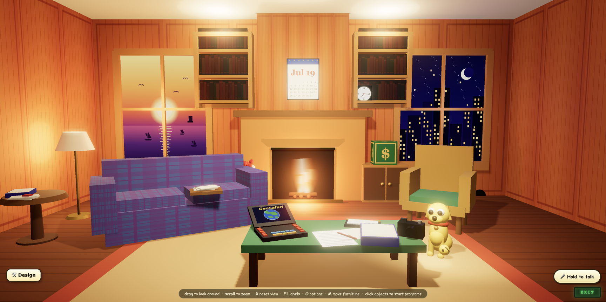
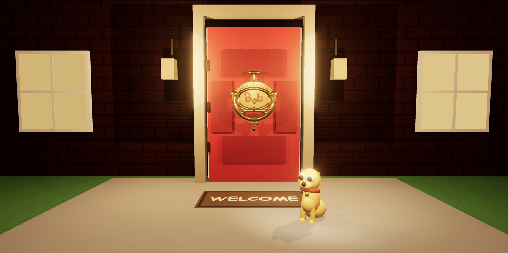
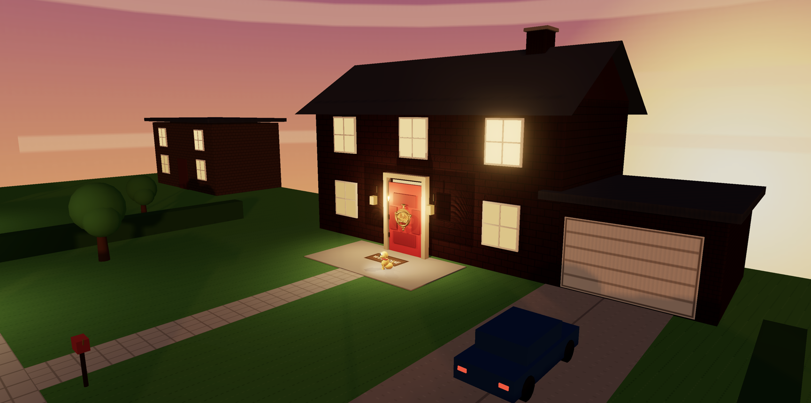
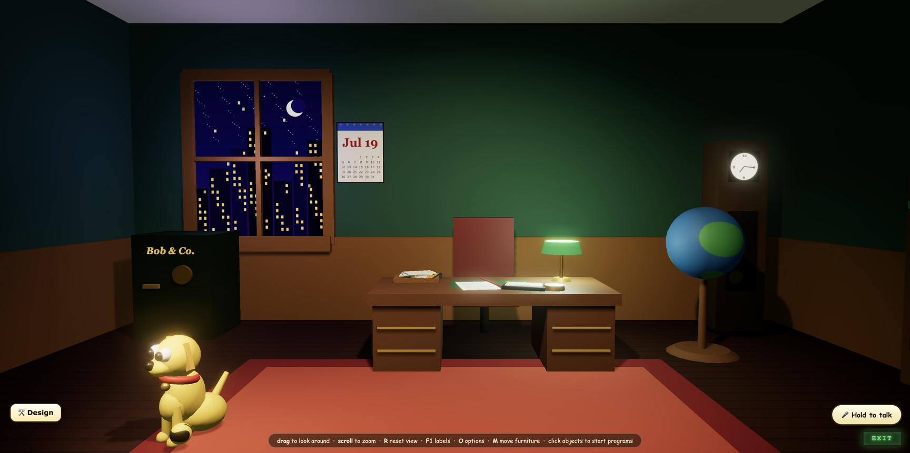
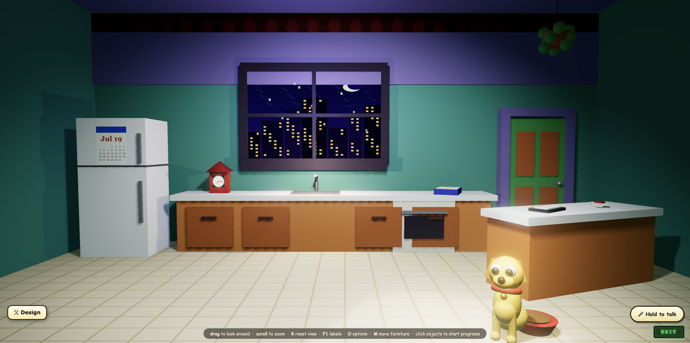
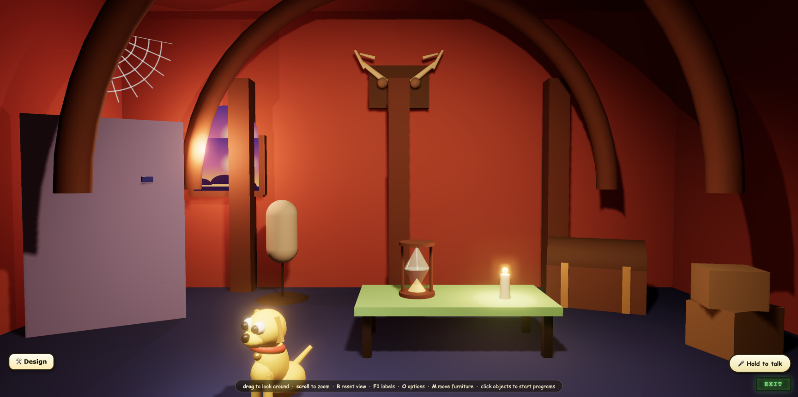
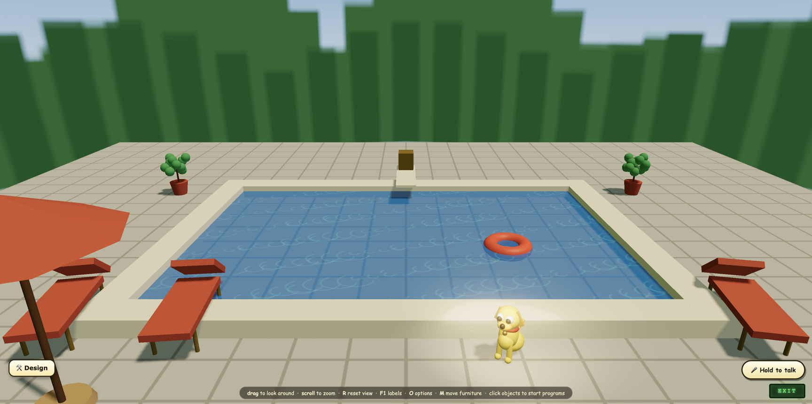

# Microsoft Bob 3D — a three.js tribute

**[▶ Live demo](https://pangalactic.github.io/bob3js/)** — knock on the door, come in, say hello to the dog.

In 1995 Microsoft shipped an operating-system shell shaped like a **house**. You lived in
decorated rooms, clicked household objects to launch programs, and a cartoon dog named
Rover offered help in speech balloons. It sold ~58,000 copies and became a punchline —
and yet, with thirty years of hindsight, it reads like an accidental sketch of the world
we live in now: assistants with personality, spatial computing, software that talks to
you. My own speculation, for what it's worth: there was no quiet genius in that. Bob
really was as much of a joke as everyone said, and nobody in Redmond was foreseeing
today's AI world — they were trying to sell home PCs to nervous families. The prophecy
is entirely in the rear-view mirror. Somehow that makes it better, not worse. The
typeface designed for its balloons (Comic Sans) missed the ship date and outlived
everything else on the box.

This is that house, rebuilt as a fully-3D world you can walk around, rearrange, and talk
to — with real-time lighting, a street outside that follows the actual time of day, all
twelve guides as low-poly critters with cloned voices, working mock-ups of every bundled
program, and objects that launch *real* applications on your machine. The cone opens VLC.
Of course the cone opens VLC.



| | |
|---|---|
|  *The famous red door — knock to sign in* |  *Zoom out: a whole street, lit by the real time of day* |
|  *The Study — globe, safe, grandfather clock* |  *The Postmodern Kitchen, city window and all* |
|  *The Castle Attic — moose antlers, hourglass* |  *The pool, one of the 2026 estate zones — Rover supervises, never swims* |

## The story of Bob — hype, flop, punchline, ghost

The tribute makes more sense if you know how strange the real story is.

**The metaphor.** By 1995 personal computing had settled, more or less permanently, on
the metaphor Xerox PARC drew and the Mac and Windows made universal: **the office**. Your
screen is a *desktop*. Documents are little sheets of paper you push around on it. They
live in *file folders*, which live in *filing cabinets*; mail arrives in an *inbox*;
Windows 95 shipped with an actual *Briefcase* for taking work home, and what you didn't
want went in the *trash* (sorry — *Recycle Bin*). It's so ingrained we forget it was ever
a choice: the computer as a place of clerical work. Bob was the road not taken — the same
idea taken literally in the opposite direction. Why should a *home* computer pretend to
be an office? Make it a **house**: a fireplace instead of a desktop, your letters written
at a writing desk in the family room, your finances in a checkbook on the table, the
calendar on the wall, and instead of a manual, a dog. Same trick — borrow a familiar
physical world so people don't have to learn an abstract one — just a warmer world to
borrow. The desktop won so completely that Bob looks absurd; but it was answering a real
question the desktop never did, and thirty years on — now that we ask a voice in the
room to do things for us — Bob's answer looks less wrong than early.

**The hype.** Bill Gates himself unveiled Bob at his CES keynote in January 1995 — a
front-page bet that the future of computing was a *"social interface"*: rooms instead of
windows, objects instead of icons, and on-screen characters who talk to you. The science
behind it was real — Stanford professors **Clifford Nass and Byron Reeves** had shown
that people instinctively treat computers as social actors, and Microsoft built a
product on it. The project (codename **Utopia**) was led by researcher **Karen Fries**;
its marketing lead was one **Melinda French** — soon after, Melinda Gates. It shipped on
**10 March 1995** at about $100, in a big yellow box with a smiley face wearing
Bill-style glasses. Watch the period marketing with modern eyes:
**[the 1995 CD-ROM TV spot](https://www.youtube.com/watch?v=2YhPozFpOC4)** and
**[the 1996 commercial](https://www.youtube.com/watch?v=IPmL6MuLsTw)** — earnest,
family-round-the-PC stuff, aired while the press was already sharpening knives.

**The product.** A house full of rooms drawn like a cartoon sitcom set, running on top
of Windows 3.1. Eight bundled programs (all rebuilt in this repo), including GeoSafari
licensed from the Educational Insights quiz toy, and an e-mail client backed by **MCI
Mail: $5 a month for 15 messages**, 45¢ per message after that, 5,000 characters
maximum, sign-up by toll-free phone call. Exactly one add-on was ever released —
**Microsoft Great Greetings**, a greeting-card pack — and the final build, v1.00a,
shipped on 30 August 1995. By then its fate was already sealed.

**The flop.** Reviewers were merciless: *The New York Times* found the characters
"irritating" and said the house looked like the work of an "esthetically challenged
sixth-grader"; *The Washington Post* called it "sterile" and "lifeless". Underpowered
machines found it unrunnable — it wanted 8 MB of RAM when most home PCs had 4 (Melinda
Gates herself conceded, decades later, that it "needed a more powerful computer than
most people had back then"). Microsoft projected millions of buyers; per PC Data it sold
about **58,000 copies**. Five months after launch, Windows 95 arrived with the biggest
marketing blitz in software history, and nobody wanted to live in a cartoon house
anymore. Bob was quietly discontinued in early 1996, less than a year old — Ballmer
later filed it under "we decided that we have not succeeded and let's stop now" — and it
settled into a long afterlife on the worst-of lists: **#7 in PC World's 25 worst tech
products of all time, CNET's worst product of its decade, one of Time's 50 worst
inventions**. A near-perfect score.

**The gap.** The deeper problem wasn't taste, it was physics: Bob tried to be genuinely
different, and 1995 couldn't cash the cheque. A social interface only works if the
characters can actually *be* social — hear you, understand you, answer in kind. That
takes speech recognition, language understanding and decent synthesis, all of which were
decades away; what a 486 with 4 MB of RAM could deliver was canned speech balloons and
multiple-choice menus. So Bob had personality without comprehension — a dog that acts
like it knows you but can't listen — and that's precisely the combination that reads as
condescending. The metaphor wrote a promise the machine couldn't keep. (That gap is the
whole reason this repo exists: run the same idea on hardware that can finally honour it —
a local Whisper for ears, a local model for wits, a cloned voice per guide — and the
dog really does hear you, understand you, and answer back in character.)

**The ghost.** Bob never really left Redmond. **Comic Sans** exists because Vincent
Connare saw Rover speaking in Times New Roman and drew something friendlier; it missed
Bob's ship date and debuted in 3D Movie Maker instead — the punchline outlived the joke.
The Office Assistant — **Clippy** — came from the same social-interface research, two
years later. **Rover was exhumed in 2001** to front Windows XP's Search Companion. Best
of all: Windows XP setup CDs carried **~30 MB of deliberately encrypted Microsoft Bob as
ballast data** — padding added (as Raymond Chen and Dave Plummer later confirmed) to
make the disc image too fat to pirate comfortably over a 56k modem. Millions of people
unknowingly installed Bob's corpse along with XP. Even the domain had an afterlife:
Microsoft bought **bob.com** from an entrepreneur named Bob, and later traded it to
*another* Bob in exchange for **windows2000.com**. This repo is the friendlier séance.

**Then and now.** Spare a thought for the people who actually built it. Bob was a
serious, multi-year effort by real craftspeople at the height of Microsoft's consumer
push — Karen Fries and Barry Linnett driving the vision, backed by Stanford academics,
character designers, animators, writers for every guide's dialogue, engineers squeezing
a cartoon world into 4 MB of RAM, testers, localisers, box artists, and a launch budget
worthy of a Gates CES keynote. Years of professional work by a building full of people —
for 58,000 copies and a punchline. This repo — the house, the street with its day/night
cycle, all twelve guides with distinct personalities and cloned voices, nine working
programs, a furniture-arranging system, and guides you can genuinely *talk to*, the
thing the original team couldn't build at any budget — was a throwaway weekend
vibe-coding project: one person, chatting with an AI, for fun. That's not a brag about
this repo; it's the punchline landing thirty years later. The effort that once took a
product division now fits in a Saturday, which means every strange dead end in
computing history is suddenly worth revisiting — this one was just first in the queue.

## Why on earth

This project is part of a wider personal exploration of **human-computer interaction** —
building and inhabiting the roads not taken. Bob is one of the most fascinating dead ends
in interface history: a "social interface" that bet everything on metaphor, personality
and place, twenty-five years before ambient computing and LLM assistants made those bets
look less silly. Rebuilding it — genuinely usable, in 3D, wired to modern speech models —
is a way of asking what it got right, what it got hilariously wrong, and which of its
instincts deserve another run on today's hardware. (Spoiler: a dog that hears you,
understands you, and answers back in character was not wrong. It was just thirty years
early and running on a 486.)

The look is deliberately drawn from the **original 1995 artwork** (studied from period
screenshots): the deep-red panelled front door with the brass *Microsoft Bob* knocker, the
warm wood family room with a sunset-harbour window and a night-city window, the plaid sofa,
the wicker chair, the postmodern teal-and-orange kitchen, the castle attic with moose antlers.

## Run it

```bash
cd bob3js
python3 serve.py          # serves the app (+ optional voice proxy, + /api/launch)
# then open http://localhost:8477
```

Voice features expect a self-hosted speech stack; point `BOB_VOICE_HOST` at yours or just
ignore it — the house works fine silent. (`python3 -m http.server 8477` also works if you
don't need voice or app launching.)

No build step, no dependencies to install — three.js 0.160 and its post-processing addons are
vendored under `lib/`. Everything is plain ES modules.

## What's in it (feature parity with the original)

### The house
- **Boot splash** — the teal screen with the black *B · smiley · B* logo and the Microsoft Home badge.
- **The red front door** — click the gold knocker to sign in; the door swings open and you
  fly into the house.
- **Four explorable rooms**, each modelled on the original's styles and connected by doors you
  click to walk through:
  - **Family Room** (warm wood, fireplace, sunset + city windows)
  - **Study** (deep green, big desk, globe, safe, grandfather clock)
  - **Postmodern Kitchen** (teal/purple/orange, city window, house-shaped clock)
  - **Castle Attic** (arched beams, moose antlers, hourglass, dusk window)
- **F1** reveals name labels on every clickable object, exactly like the original.
- **Live details**: the wall calendar shows today's date, the clocks tell the real time, the
  fire flickers, the moon window shows the real current moon phase (in the Calendar app), the
  candle guttering in the attic drives a real point light.

### The eight bundled programs + the clock
Every program that shipped with Bob, as an interactive mock-up styled after its 1995 screenshot:

| Program | Notes |
|---|---|
| **Letter Writer** | Rich-text editor, font/size/bold/italic, swappable borders, the original "can-opener 1347B" sample letter |
| **Calendar** | Spiral-bound day view, mini-month, **live moon-phase panel**, Day/Week/Month/To-Do tabs, events you can type and that persist |
| **Checkbook** | Register with running balance, write & record checks, Check/Receive/Spend/Transfer tabs — with its **own 3D guide** |
| **Address Book** | Blue spiral binder, A–Z thumb tabs, add/turn pages, saved to local storage |
| **Household Manager** | All **14** original topics (Auto Information … Vacations) with sample lists |
| **Financial Guide** | 10 finance topics with sample budgets and savings plans |
| **E-Mail** | The @BOB.COM pigeonhole mailroom, inbox/outbox, compose (a nod to the MCI-Mail subscription) |
| **GeoSafari** | A genuinely playable US-geography quiz (3 tries per question, scoring) hosted by **Hank the elephant** |
| **Bob Clock** | Live analog + digital clock |

### The guides — all twelve Friends of Bob
Every guide from version 1.00 is here as a **low-poly 3D character**, switchable from the guide
picker (press **G**, click the guide, or Options → Change your guide):

> Rover · Blythe · Chaos · Hopper · Java · Orby · Ruby · Scuzz · Shelly · Digger · Speaker · The Invisible Guide

- Each guide has its own **personality, signature word** (Rover's is genuinely "scrumptious"),
  and **specialty** — it greets you and offers to open the programs it knows best (Scuzz the
  rat pushes the Checkbook; Orby the planet pushes GeoSafari; and so on).
- **Hand-over, just like the original**: when you switch guides the current one says *"Goodbye
  for now… I'll hand you over to …"* with a little farewell hop, then the new guide takes over.
- **Dedicated in-app guides are real 3D characters**, not flat pictures: the Checkbook's
  purple ledger-faced helper and GeoSafari's Hank the elephant are each rendered live in their
  own mini three.js view inside the app window.
- **Guides roam**: click any empty patch of floor and the guide waddles over to it.

### Rearrange everything (the "Change something" system)
Bob let you move, resize, and delete the furniture and decorations. Press **M** (or Options →
Rearrange the room), click any piece, and you get the original's **"How do you want to change
the …?"** menu: **Move · Bigger · Smaller · Turn · Closer · Farther · Copy · Delete · Done**.
Moves are drag-and-drop on the floor; every change persists in local storage. Options → Reset
the room puts it all back.

## Controls

| Key / action | Does |
|---|---|
| Click the knocker | Sign in |
| Click an object | Launch its program |
| Click a door | Walk to the next room |
| Click empty floor | Send your guide there |
| **F1** | Toggle object labels |
| **G** | Change guide |
| **O** | Options menu |
| **M** | Rearrange furniture |
| **Esc** | Close app / finish arranging |
| Exit sign | Leave (back to the front door) |

## How it's built

```
index.html          boot splash, canvas, 2D overlay
css/bob.css          all app-window + balloon styling
js/main.js           renderer, bloom, room navigation, picking, guide walking + arrange mode
js/rooms.js          the porch + four rooms, modelled from the original screenshots
js/guides.js         the 12 guides + Hank + the ledger guide, all parametric low-poly 3D
js/portrait.js       live 3D character renderer mounted inside the 2D apps
js/apps.js           the nine program mock-ups, options menu, dialogs
js/util.js           materials, canvas-texture painters (sunset, city, plaid, books…), tweens
lib/                 vendored three.js 0.160 + postprocessing addons
```

Rendering uses `ACESFilmicToneMapping`, soft shadow maps, an `UnrealBloomPass` for the warm
glow, and hand-painted canvas textures for the windows, books, plaid, and calendar so there
are **no external image assets** — the whole thing is self-contained.

---

*A tribute, not a Microsoft product. Microsoft Bob and Rover are properties of Microsoft.
Fun fact honoured in the About box: Comic Sans was designed for Bob's speech balloons but
missed the ship date.*

---

## BobOS — the kernel you build on

`js/os.js` is a small kernel the whole house runs on. It's what makes this extensible
rather than a demo:

```js
import { BobOS } from './os.js';

BobOS.apps.register({
  id: 'notepad', name: 'Notepad', icon: '📝',
  launch(ctx) { /* draw your app; ctx.say/sound/user are the shell services */ },
});
```

Register an app and it appears in **Find a program** and launches by id — no core edits.

| Service | What it gives you |
|---|---|
| `BobOS.fs` | virtual filesystem — `read/write/update/list/remove/removeDir`, JSON, namespaced paths (`calendar/events/2026-07-16`). Swap the backing store without touching an app. |
| `BobOS.apps` | app registry — `register(manifest)`, `list()`, `launch(id)` |
| `BobOS.bus` | event bus — `on/once/off/emit`, plus `'*'` firehose. Emits `fs:write`, `apps:launch`, `notify`, `boot`. |
| `BobOS.notify` | route a message to whichever guide is on screen |

All nine built-in programs are registered through it and store their data in the VFS.

## Voice — talk to the guides

Hold the **🎤 mic button** (or **Space**) and speak. The loop:

```
mic → 16 kHz WAV → /api/stt  → Whisper large-v3-turbo (MLX)   garage:8765
                 → /api/chat → ollama persona reply            garage:11434
                 → /api/tts  → Chatterbox, the guide's voice    garage:8093
```

`serve.py` proxies all three so the browser stays same-origin (no CORS).

**Each guide has their own cloned voice.** Voices were designed with ElevenLabs Voice Design
(personas written by a headless `codex exec` agent — see `voices/roster.json`), then cloned onto
the garage Chatterbox worker. Convention follows the house `hero-assets` recipe: 3 takes per
character, **take-1 canonical**, 10s trim, mono 24 kHz.

```bash
cd voices
python3 generate_takes.py [keys…]   # ElevenLabs Voice Design → <key>-{1,2,3}.wav
python3 clone_takes.py    [keys…]   # trim, scp to garage:pannyflow/data/voices/, verify
```

Swap a voice later: `cp <key>-2.wav <key>.wav` locally and on garage. No map edit, no restart.

## The 2026 architecture — a composable world

Since the first build, the house has been rebuilt as a fully **data-driven world**:

- **Every room is a zone spec** (`js/zones.js`): fixtures (the non-movable shell) plus
  `placed[]` records for every piece of furniture, persisted per-object in the BobOS
  virtual filesystem. Move anything in arrange mode and it stays moved, forever.
- **Actions are orthogonal to objects.** Any placed record can carry `app:` (open a Bob
  program), `zone:` (travel), `launch:` (open a real native app) or `action:` (custom).
  The record wins over the catalogue default — a flower vase can launch VLC if you insist.
- **The porch is a street.** Zoom out from the famous red door and there's a whole
  neighbourhood — garage, driveway, road with passing cars, streetlamps, neighbours —
  lit by the real time of day (dawn / day / dusk / night).
- **Comic Sans is the voice of the house.** The typeface was originally designed for
  Bob's speech balloons and missed the ship date; here it finally does its job — balloons,
  labels, buttons, and the WELCOME mat. Document surfaces keep their period serif look.

## Voice & brains — bring your own

**Options → Voice & brains setup** connects the guides' ears, voices and wits, entirely
browser-side (it works from static hosting too; the only feature that genuinely needs a
local process is app launching):

- **The sweet spot — your own servers.** This is how the house was developed and where it
  shines: a self-hosted **Chatterbox** worker speaking each guide's *cloned voice*, local
  **Whisper** for ears, and a small local model (**qwen3.5** and **gemma4**-class models
  both run the guides beautifully) via ollama's OpenAI-compatible endpoint. Point the
  STT / TTS / chat URL fields at your boxes, or run `serve.py` locally and let it proxy
  (no CORS needed). Latency is lovely and the marginal cost is zero.
- **The convenience path — an OpenAI key.** Added so the hosted demo works for anyone:
  paste a key and you get ears (`gpt-4o-mini-transcribe`), brains (`gpt-5.6-luna` by
  default — press *List available models* to pick from what your key actually has), and
  steered voices, each guide characterised with the same persona prompts that designed
  the cloned cast (`voices/roster.json`). The key lives only in your browser and is sent
  only to OpenAI; use a spend-capped project key.
- **No setup at all**: the guides still talk using your browser's built-in voices — which
  on Windows are Microsoft's own, historically appropriate.

## Launching real apps (`/api/launch`)

Some objects open actual applications on the machine running `serve.py`: the traffic cone
opens VLC, the calculator on the study desk opens Calculator, the brass compass opens
Safari, the mailbox on the front path opens Mail. The endpoint is a **strict whitelist** —
the browser sends an id, only the server-side map decides what runs, and nothing
user-controlled ever reaches the shell. The commands are macOS (`open -a`) today; the
equivalent on Windows is `start` and on Linux `xdg-open`/`gtk-launch` — one small switch
if you port it. The web app itself is plain three.js and runs anywhere a browser does.

## What's deliberately not in this repo

The reference material used to study the original's look (period screenshots and live
captures of a Microsoft Bob VM) and the generated guide voice WAVs are not distributed
here — the first isn't ours to redistribute, the second is 39 MB of audio you can
regenerate with the scripts in `voices/`.

## Tribute status & licence

This is an **unofficial fan tribute**, not affiliated with or endorsed by Microsoft.
*Microsoft Bob* and associated marks are trademarks of Microsoft Corporation; they're
referenced here for commentary and homage. All code and all 3D/2D artwork in this repo
are original, hand-built for this project, and released under the **MIT License** (see
`LICENSE`). The vendored copy of [three.js](https://threejs.org) in `lib/` is MIT-licensed
by its authors.
